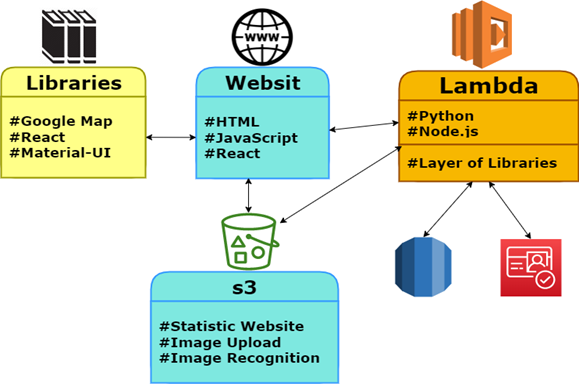

<h1 align="center"> Muni-LEIMS⚡🌍 </h1>
<h3 align="center"> Object Detection </h3>
<h5 align="center"> Final Project <a href="https://www.shenkar.ac.il/he">Shenkar Collage</a> (2022) </h5>

Muni-Light	Energy Intensity  Mapping System 

<h2> :floppy_disk: Project Features Library and Languages Description</h2>

### Front-End
* HTML.
* JavaScript.
* Google Map for visualized map and located switchboards.
* Material-UI for component and style.
* React-plotly for Graph.
* Google Map for visualized map and located switchboards.
* Material-UI for component and style.
* React-plotly for Graph.

### Backend
* Node.js.
* Python.
* Layers.
* S3 AWS.
* RDS MySQL.
* Cognito AWS.

 

### Cloud – AWS Architecture

 

<h2> :book: Introduction</h2>

Our approach to the solution of the streetlights mapping problem is based on image processing and computer vision. The system gets aerial images of the streets to be analyzed. These images are supplied by municipalities workers that also assign the relevant switchboards to the given image and provide the electricity consumption data of each switchboard. Our computer vision algorithm recognizes the streetlights in the given image, estimate their number, and computes the energy intensity measure per assigned.
The system is then able to analyze the data, compute the appropriate energy intensity measures and the appropriate alerts and indicate anomalies and irregularities. The user interface also provides a visualized map, provide statistical and comparative data according to the user request and according to their permissions.

## Screenshots

Login Page  |  SignUp Page 
:------------------------:|:-------------------------:
  |  

Home Page Ministry  |  Home Page Muncipality
:------------------------:|:-------------------------:
  |   

Map Page Ministry  |  Map Page Muncipality
:------------------------:|:-------------------------:
  |   

Top/Last Ranking Page Ministry  |  Top/Last Ranking Page Muncipality
:------------------------:|:-------------------------:
  |   

<h2> :clipboard: Execution Instruction</h2>

The order of execution of the program files is as follows:

First, git clone https://github.com/idankario/Muni-LEIMS

<b>2) npm i</b>

<h2> :books: Refrences</h2>
<ul>
    <li>
        

            Authors: Prof. Gershon Grossman, Tal Goldrath, Michal Nachmani.
            Date: February 2011.
            Document Title: Summary and Recommendations Discussion Forum Energy No. 19 Samuel Neaman Institute,
            Technion, [pages 3-7 pages doc 22-33].
        

    </li>
    <li>
        

            Authors: Ministry of National Infrastructure, Energy and Water
            Date: February 2015
            Document Title: The National Energy Efficiency Plan 2016 - 2030, [pages 2-7]
        

    </li>
    </li>
    <li>
        

            Authors: Ministry of Energy
            Date: 2020
            Document Title: National State Energy Efficiency Plan November 2020-2030, [pages 2,7]
        

    </li>
    <li>
        

            Authors: The State Comptroller
            Date: July 2020
            Document Title: The State Comptroller Reports on the Audit of Local Government for 2020, [pages 3]
        

    </li>
    <li>
        

            Authors: The State Comptroller
            Date: 2020
            Document Title: State Comptroller Reports on the Audit of Local Government 2020, [pages 2,7 pages doc
            299]
        

    </li>
    <li>
        

            Authors: Ministry of Energy
            Date: January 2015
            Document Title: Ministry of Energy National Energy Efficiency Plan 2016-2030, [pages 3]
        

    </li>
    </li>
    <li>
        

            Authors: Dr. Shachar Dolev, The Israeli Energy Forum
            Date: December 2010
            Document Title: The Energy Chapter in the Environmental Tag Program Energy Efficiency A Guide for Local
            Authorities 2010, [pages 6-8]
        

    </li>
    <li>
        

            Authors: Maariv
            Date: September 2017
            Document Title: Waste in Local Authorities: NIS 220 Million a Year due to outdated Lighting Maariv,
            [page 2-9]
        

    </li>
    <li>
        

            Authors: Government Spokeswoman Announcements
            Date: October 2021
            Document Title: Prime Minister Bennett and Minister of Energy Elharar agreed on setting a national
            target, zero greenhouse gas emissions by 2050 [page 2]
        

    </li>
    <li>
        

            Authors: Y M Jagadeesha, S Akilesha , S Karthika*, Prasantha
            Date: October2015-----
            Document Title: Intelligent Street Lights
        

    </li>
    <li>
        

            Authors: Department of Electrical Engineering Education, Universitas Pendidikan Indonesia
            Date: 2019
            Document Title: Performance analysis of Light Emitting Diode, High Sodium Pressure and Metal Halide
            Lights
        

    </li>
    <li>
        

            Authors: Umberto Berardi
            Date: May 2021
            Document Title: Intelligent Street Lighting in a Smart City Concepts—A Direction to Energy Saving in
            Cities: An Overview and Case Study
        

    </li>
    </li>
    <li>
        

            Authors: Alexandru Ioan Cuza University, Carol I Blvd., No. 22, 700505 Iași, Romania
            Date: Dec 2021
            Document Title: Front-End Frameworks for Development of Spa and Mpa Web Applications
        

    </li>
    <li>
        

            Authors: Masaryk University Faculty of Informatics
            Date: 2020
            Document Title: Development of Modern User Interfaces in Angular Framework
        

    </li>
    <li>
        

            Authors: Faculty of Science University of Helsinki
            Date: April 2021
            Document Title: A performance comparison of rendering strategies in open source web frontend frameworks
        

    </li>
    <li>
        

            Authors: Nishtha Jatana Sahil Puri Mehak Ahuja Ishita Kathuria Dishant Gosain
            Date: Aug 2012
            Document Title: A Survey and Comparison of Relational and Non-Relational Database
        

    </li>
    <li>
        

            Authors: Cornelia Győrödi, Robert Győrödi, Romania, Roxana Sotoc
            Date: Nov 2015
            Document Title: A Comparative Study of Relational and NonRelational Database Models in a Web- Based
            Application
        

    </li>
</ul>

<!-- CREDITS -->
<h2 id="credits"> :scroll: Credits</h2>

Mohammad Idan Kario 

